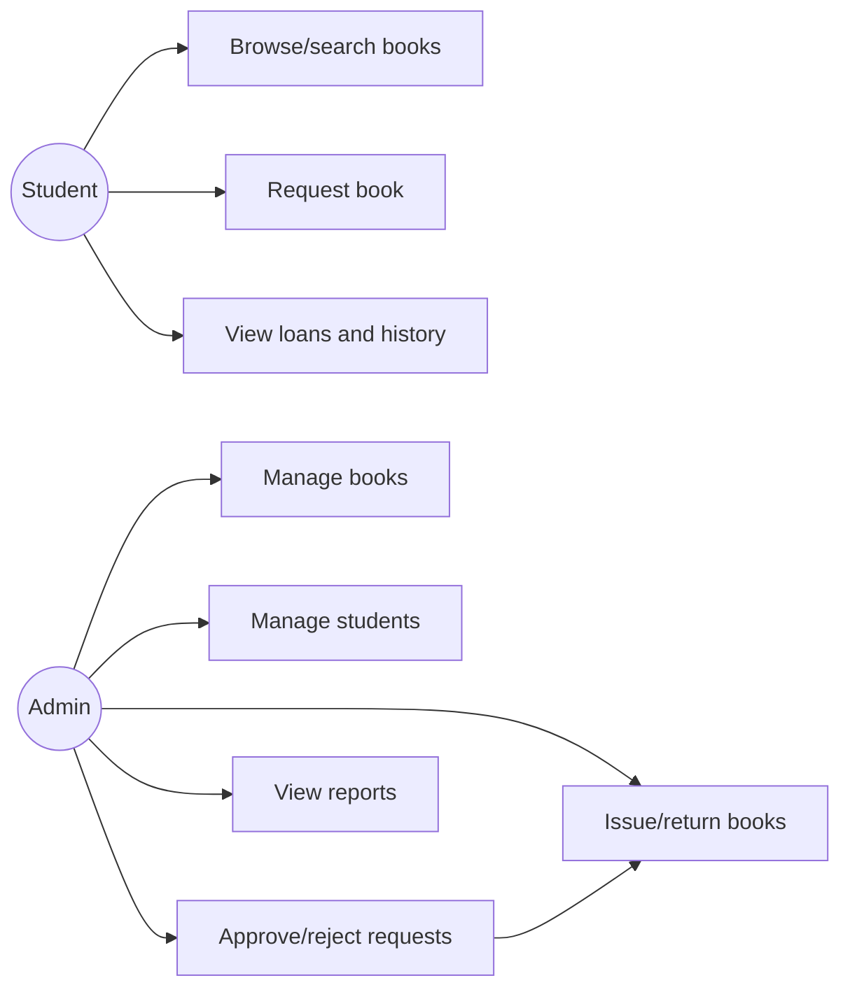
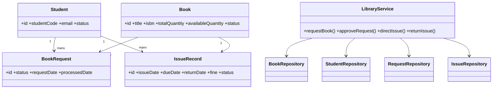
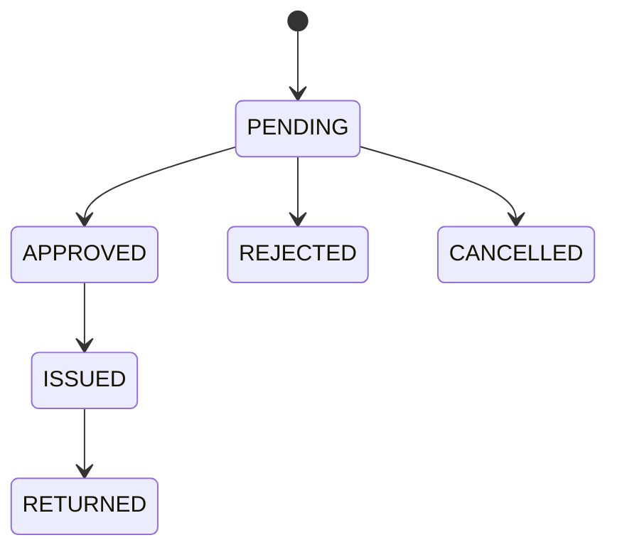
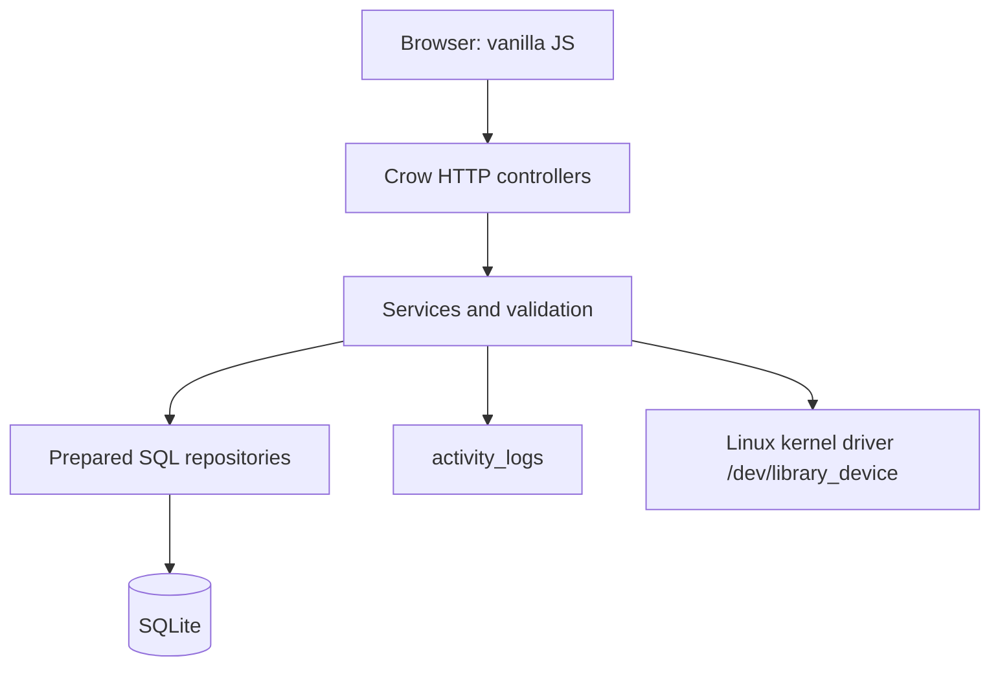

# UML diagrams

## Use case diagram



## Class diagram



## Request approval sequence

```mermaid
sequenceDiagram
 participant S as Student UI
 participant A as Admin UI
 participant API as Crow API
 participant L as LibraryService
 participant DB as SQLite
 S->>API: POST request(bookId)
 API->>L: validate student/book/no duplicate
 L->>DB: INSERT PENDING request
 A->>API: PATCH approve(dueDate)
 API->>L: approve request
 L->>DB: BEGIN; decrement copy; insert issue; approve request; log; COMMIT
 API-->>A: success
```

## Return sequence

```mermaid
sequenceDiagram
 participant A as Admin
 participant API as Crow API
 participant L as LibraryService
 participant DB as SQLite
 A->>API: PATCH issue/return(returnDate)
 API->>L: validate active issue, calculate fine
 L->>DB: BEGIN; mark RETURNED; increment copy; log; COMMIT
 API-->>A: fine and success
```

## State diagram



## System architecture diagram


